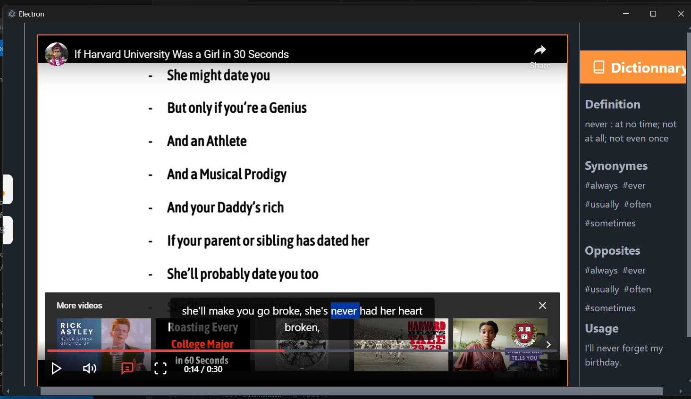

# Faseeh: Interactive Language Learning Platform

## Abstract

### Background and Problem Statement

In today’s digital age, traditional language learning methods often fail to engage learners with real-life content. Resources are limited, and many do not suit the specific needs of learners seeking practical language skills. There’s a rising demand for interactive, multimedia-based tools that can make learning more engaging and effective.

### Impact and Proposed Solution

Faseeh aims to tackle these challenges by transforming multimedia content, like videos, into interactive language learning materials. Using AI, the platform provides automatic video transcriptions, generates quizzes, builds personalized dictionaries, and offers pronunciation and grammar correction. These features help learners improve their language skills in an engaging and practical way.

### Project Outcomes and Deliverables

- A cross-platform Electron desktop application
- AI-powered transcription of videos for language learning
- Personalized vocabulary enhancement tools and quizzes
- Pronunciation and grammar correction features
- User-friendly interface built with React and TypeScript
- Real-time analysis and personalized feedback


### Pronunciation Feature (Not Yet Integrated)

While **pronunciation correction** was planned as a key feature, it was not fully integrated in this version due to technical limitations. However, it remains a priority for future development, and we aim to incorporate it as soon as possible.


## Instructions

To run the Faseeh project locally, follow these steps:

1. Clone the repository:

   ```bash
   git clone <repository-url>
    ```
### Install

```bash
$ npm install
```

### Development

```bash
$ npm run dev
```

### Build

```bash
# For windows
$ npm run build:win

# For macOS
$ npm run build:mac

# For Linux
$ npm run build:linux
```
